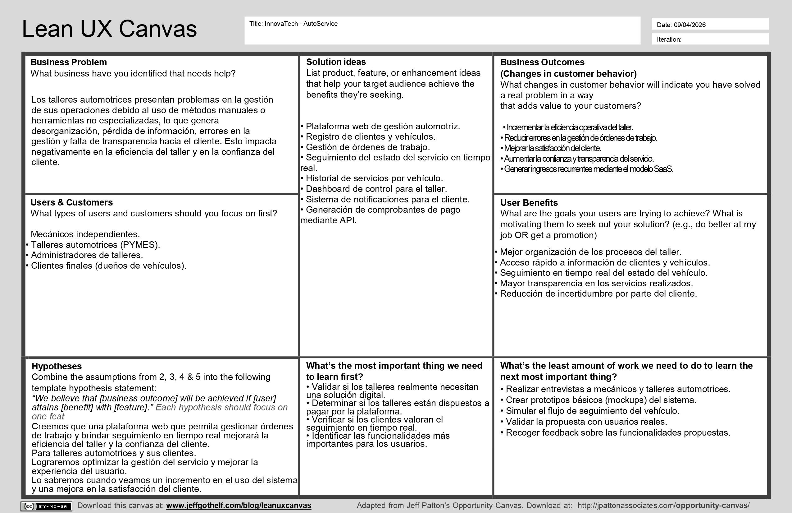

# Documentación del Trabajo Final - 1ASI0730 <!-- omit in toc -->

<div align="center">
  
<br>
Universidad Peruana de Ciencias Aplicadas<br>
Facultad de Ingenería, Carrera de Ingeniería de Software<br>
**Ciclo:** 2026-10

**AV1 – Sprint Review**

**1ASI0730** Aplicaciones Web<br>
**NRC:** 17953<br>
**Profesor:** Alex Humberto Sánchez Ponce<br>

**Nombre del startup:** InnovaTech<br>
**Nombre del producto:** MindCare<br>
Abril, 2026

#### Relación de integrantes <!-- omit in toc -->

  <table style="margin: auto;">
    <thead>
      <tr>
        <th style="text-align: left;">Código</th>
        <th style="text-align: left;">Apellidos y Nombres</th>
      </tr>
    </thead>
    <tbody>
      <tr>
        <td>U202421866</td>
        <td>Lopez Monroy, Rodrigo Alfredo</td>
      </tr>
      <tr>
        <td>U20241D185</td>
        <td>Luis Miranda, Diego Andres</td>
      </tr>
      <tr>
        <td>U20241E299</td>
        <td>Mamani Vilca, Alan Jaivi</td>
      </tr>
      <tr>
        <td>U202418823</td>
        <td>Pillaca Gonzales, Andy Saúl</td>
      </tr>
      <tr>
        <td>U202319404</td>
        <td>Sanchez Cuadrado, Juan Antonio</td>
      </tr>
    </tbody>
  </table>

</div>

---

<br>
<br>
<br>

## Registro de Versiones del Informe <!-- omit in toc -->

<div align="center">
  <table style="margin: auto; text-align: center;">
    <thead>
      <tr>
        <th style="text-align: center;">Versión</th>
        <th style="text-align: center;">Fecha</th>
        <th style="text-align: center;">Autores</th>
        <th style="text-align: left;">Descripción de modificación</th>
      </tr>
    </thead>
    <tbody>
      <tr>
        <td>V1.0</td>
        <td>22/04/2026</td>
        <td>Lopez Monroy, Rodrigo Alfredo<br>Luis Miranda, Diego Andres<br>Mamani Vilca, Alan Jaivi<br>Pillaca Gonzales, Andy Saúl<br>Sanchez Cuadrado, Juan Antonio</td>
        <td style="text-align: left;">Versión inicial del informe.</td>
      </tr>
      <tr>
        <td>V2.0</td>
        <td>--/--/2026</td>
        <td>Lopez Monroy, Rodrigo Alfredo<br>Luis Miranda, Diego Andres<br>Mamani Vilca, Alan Jaivi<br>Pillaca Gonzales, Andy Saúl<br>Sanchez Cuadrado, Juan Antonio</td>
        <td style="text-align: left;"><i>Pendiente</i></td>
      </tr>
      <tr>
        <td>V3.0</td>
        <td>--/--/2026</td>
        <td>Lopez Monroy, Rodrigo Alfredo<br>Luis Miranda, Diego Andres<br>Mamani Vilca, Alan Jaivi<br>Pillaca Gonzales, Andy Saúl<br>Sanchez Cuadrado, Juan Antonio</td>
        <td style="text-align: left;"><i>Pendiente</i></td>
      </tr>
      <tr>
        <td>V4.0</td>
        <td>--/--/2026</td>
        <td>Lopez Monroy, Rodrigo Alfredo<br>Luis Miranda, Diego Andres<br>Mamani Vilca, Alan Jaivi<br>Pillaca Gonzales, Andy Saúl<br>Sanchez Cuadrado, Juan Antonio</td>
        <td style="text-align: left;"><i>Pendiente</i></td>
      </tr>
    </tbody>
  </table>
</div>

---

## Project Report Collaboration Insights <!-- omit in toc -->

* **URL del Repositorio de GitHub:** https://github.com/InnovaTechStudio/MindCare-1ASI0730-AW
* **AV1:** *Pendiente*

---

## Contenido <!-- omit in toc -->

- [Student Outcome](#student-outcome)
- [Capítulo I: Introducción](#capítulo-i-introducción)
  - [1.1. Startup Profile](#11-startup-profile)
    - [1.1.1. Descripción de la Startup](#111-descripción-de-la-startup)
    - [1.1.2. Perfiles de integrantes del equipo](#112-perfiles-de-integrantes-del-equipo)
  - [1.2. Solution Profile](#12-solution-profile)
    - [1.2.1 Antecedentes y problemática](#121-antecedentes-y-problemática)
    - [1.2.2 Lean UX Process](#122-lean-ux-process)
      - [1.2.2.1. Lean UX Problem Statements](#1221-lean-ux-problem-statements)
      - [1.2.2.2. Lean UX Assumptions](#1222-lean-ux-assumptions)
      - [1.2.2.3. Lean UX Hypothesis Statements](#1223-lean-ux-hypothesis-statements)
      - [1.2.2.4. Lean UX Canvas](#1224-lean-ux-canvas)
  - [1.3. Segmentos objetivo](#13-segmentos-objetivo)
- [Capítulo II: Requirements Elicitation \& Analysis](#capítulo-ii-requirements-elicitation--analysis)
  - [2.1. Competidores](#21-competidores)
    - [2.1.1. Análisis competitivo](#211-análisis-competitivo)
  - [Competitive Analysis Landscape](#competitive-analysis-landscape)
    - [2.1.2. Estrategias y tácticas frente a competidores](#212-estrategias-y-tácticas-frente-a-competidores)
  - [2.2. Entrevistas](#22-entrevistas)
    - [2.2.1. Diseño de entrevistas](#221-diseño-de-entrevistas)
    - [2.2.2. Registro de entrevistas](#222-registro-de-entrevistas)
    - [2.2.3. Análisis de entrevistas](#223-análisis-de-entrevistas)
  - [2.3. Needfinding](#23-needfinding)
    - [2.3.1. User Personas](#231-user-personas)
    - [2.3.2. User Task Matrix](#232-user-task-matrix)
    - [2.3.3. User Journey Mapping](#233-user-journey-mapping)
    - [2.3.4. Empathy Mapping](#234-empathy-mapping)
  - [2.4. Big Picture EventStorming](#24-big-picture-eventstorming)
  - [2.5. Ubiquitous Language](#25-ubiquitous-language)
- [Capítulo III: Requirements Specification](#capítulo-iii-requirements-specification)
  - [3.1. User Stories](#31-user-stories)
  - [3.2. Impact Mapping](#32-impact-mapping)
  - [3.3. Product Backlog](#33-product-backlog)
- [Capítulo IV: Product Design](#capítulo-iv-product-design)
  - [4.1. Style Guidelines](#41-style-guidelines)
    - [4.1.1. General Style Guidelines](#411-general-style-guidelines)
    - [4.1.2. Web Style Guidelines](#412-web-style-guidelines)
  - [4.2. Information Architecture](#42-information-architecture)
    - [4.2.1. Organization Systems](#421-organization-systems)
    - [4.2.2. Labeling Systems](#422-labeling-systems)
    - [4.2.3. SEO Tags and Meta Tags](#423-seo-tags-and-meta-tags)
    - [4.2.4. Searching Systems](#424-searching-systems)
    - [4.2.5. Navigation Systems](#425-navigation-systems)
  - [4.3. Landing Page UI Design](#43-landing-page-ui-design)
    - [4.3.1. Landing Page Wireframe](#431-landing-page-wireframe)
    - [4.3.2. Landing Page Mock-up](#432-landing-page-mock-up)
  - [4.4. Web Applications UX/UI Design](#44-web-applications-uxui-design)
    - [4.4.1. Web Applications Wireframes](#441-web-applications-wireframes)
    - [4.4.2. Web Applications Wireflow Diagrams](#442-web-applications-wireflow-diagrams)
    - [4.4.3. Web Applications Mock-ups](#443-web-applications-mock-ups)
    - [4.4.4. Web Applications User Flow Diagrams](#444-web-applications-user-flow-diagrams)
  - [4.5. Web Applications Prototyping](#45-web-applications-prototyping)
  - [4.6. Domain-Driven Software Architecture](#46-domain-driven-software-architecture)
    - [4.6.1. Design-Level EventStorming](#461-design-level-eventstorming)
    - [4.6.2. Software Architecture Context Diagram](#462-software-architecture-context-diagram)
    - [4.6.3. Software Architecture Container Diagrams](#463-software-architecture-container-diagrams)
    - [4.6.4. Software Architecture Components Diagrams](#464-software-architecture-components-diagrams)
  - [4.7. Software Object-Oriented Design](#47-software-object-oriented-design)
    - [4.7.1. Class Diagrams](#471-class-diagrams)
  - [4.8. Database Design](#48-database-design)
    - [4.8.1. Database Diagrams](#481-database-diagrams)
- [Capítulo V: Product Implementation, Validation \& Deployment](#capítulo-v-product-implementation-validation--deployment)
  - [5.1. Software Configuration Management](#51-software-configuration-management)
    - [5.1.1. Software Development Environment Configuration](#511-software-development-environment-configuration)
    - [5.1.2. Source Code Management](#512-source-code-management)
    - [5.1.3. Source Code Style Guide \& Conventions](#513-source-code-style-guide--conventions)
    - [5.1.4. Software Deployment Configuration](#514-software-deployment-configuration)
  - [5.2. Landing Page, Services \& Applications Implementation](#52-landing-page-services--applications-implementation)
    - [5.2.1. Sprint 1](#521-sprint-1)
      - [5.2.1.1. Sprint Planning 1](#5211-sprint-planning-1)
      - [5.2.1.2. Aspect Leaders and Collaborators](#5212-aspect-leaders-and-collaborators)
      - [5.2.1.3. Sprint Backlog 1](#5213-sprint-backlog-1)
      - [5.2.1.4. Development Evidence for Sprint Review](#5214-development-evidence-for-sprint-review)
      - [5.2.1.5. Execution Evidence for Sprint Review](#5215-execution-evidence-for-sprint-review)
      - [5.2.1.6. Services Documentation Evidence for Sprint Review](#5216-services-documentation-evidence-for-sprint-review)
      - [5.2.1.7. Software Deployment Evidence for Sprint Review](#5217-software-deployment-evidence-for-sprint-review)
      - [5.2.1.8. Team Collaboration Insights during Sprint](#5218-team-collaboration-insights-during-sprint)
  - [5.3. Validation Interviews](#53-validation-interviews)
    - [5.3.1. Diseño de Entrevistas](#531-diseño-de-entrevistas)
    - [5.3.2. Registro de Entrevistas](#532-registro-de-entrevistas)
    - [5.3.3. Evaluaciones según heurísticas](#533-evaluaciones-según-heurísticas)
  - [5.4. Video About-the-Product](#54-video-about-the-product)
- [Conclusiones](#conclusiones)
  - [Conclusiones y recomendaciones](#conclusiones-y-recomendaciones)
  - [Video About-the-Team](#video-about-the-team)
- [Bibliografía](#bibliografía)
- [Anexos](#anexos)

---

## Student Outcome

<div align="center">
  <table style="margin: auto; text-align: left;">
    <thead>
      <tr>
        <th>Criterio específico</th>
        <th>Acciones realizadas</th>
        <th>Conclusiones</th>
      </tr>
    </thead>
    <tbody>
      <tr>
        <td>Trabaja en equipo para proporcionar liderazgo en forma conjunta.</td>
        <td>
          <b>Lopez Monroy, Rodrigo Alfredo</b> AV1:(ACCIONES REALIZADAS)<br>
          <b>Luis Miranda, Diego Andres</b> AV1:(ACCIONES REALIZADAS)<br>
          <b>Mamani Vilca, Alan Jaivi</b> AV1:(ACCIONES REALIZADAS)<br>
          <b>Pillaca Gonzales, Andy Saúl</b> AV1:(ACCIONES REALIZADAS)<br>
          <b>Sanchez Cuadrado, Juan Antonio</b> AV1:(ACCIONES REALIZADAS)
        </td>
        <td>AV1: Pendiente (Grupal)</td>
      </tr>
      <tr>
        <td>Crea un entorno colaborativo e inclusivo, establece metas, planifica tareas y cumple objetivos.</td>
        <td>
          <b>Lopez Monroy, Rodrigo Alfredo</b> AV1:(ACCIONES REALIZADAS)<br>
          <b>Luis Miranda, Diego Andres</b> AV1:(ACCIONES REALIZADAS)<br>
          <b>Mamani Vilca, Alan Jaivi</b> AV1:(ACCIONES REALIZADAS)<br>
          <b>Pillaca Gonzales, Andy Saúl</b> AV1:(ACCIONES REALIZADAS)<br>
          <b>Sanchez Cuadrado, Juan Antonio</b> AV1:(ACCIONES REALIZADAS)
        </td>
        <td>AV1: Pendiente (Grupal)</td>
      </tr>
    </tbody>
  </table>
</div>

---

## Capítulo I: Introducción

### 1.1. Startup Profile
<p align="justify"> El Startup Profile presenta una visión general del equipo y de la propuesta de valor del proyecto, describiendo el enfoque de la solución, el contexto en el que se desarrolla y las capacidades del equipo de trabajo. Esta sección permite comprender la finalidad de la startup, así como el aporte de cada integrante en el desarrollo del sistema. </p>

#### 1.1.1. Descripción de la Startup

<p align="justify"> Nuestra startup tiene como objetivo desarrollar una plataforma web orientada a la gestión integral de talleres automotrices, permitiendo optimizar los procesos operativos, mejorar la organización interna y brindar mayor transparencia al cliente final. <br><br> La solución está dirigida principalmente a mecánicos independientes y talleres automotrices (PYMES), quienes actualmente enfrentan dificultades en la gestión de clientes, vehículos, órdenes de trabajo y seguimiento de servicios. A través de este sistema, se busca centralizar la información, digitalizar procesos y facilitar la comunicación entre el taller y el cliente. <br><br> La plataforma permitirá registrar clientes y vehículos, gestionar órdenes de trabajo, realizar seguimiento del estado del servicio en tiempo real, controlar pagos y generar historiales detallados por vehículo. Además, el sistema implementa un modelo SaaS (Software as a Service), donde los talleres pagan una suscripción mensual para acceder a funcionalidades avanzadas, mientras que los clientes finales pueden acceder gratuitamente para visualizar el estado de sus servicios. <br><br> De esta manera, la startup busca aportar valor tanto al taller, mejorando su eficiencia y control, como al cliente, incrementando la confianza y transparencia en el servicio automotriz. </p>

#### 1.1.2. Perfiles de integrantes del equipo

<div align="center">
  <table style="margin: auto; width: 100%; border-collapse: collapse; border: 1px solid #ddd;">
    <tbody>
      <!-- Integrante 1 -->
      <tr>
        <td style="padding: 20px; border: 1px solid #ddd; width: 70%; vertical-align: middle; text-align: left;">
          <strong>Lopez Monroy, Rodrigo Alfredo</strong><br><br>
          <i>Descripción pendiente...</i>
        </td>
        <td style="padding: 10px; border: 1px solid #ddd; width: 30%; text-align: center; vertical-align: middle;">
          
        </td>
      </tr>
      <!-- Integrante 2 -->
      <tr>
        <td style="padding: 20px; border: 1px solid #ddd; vertical-align: middle; text-align: left;">
          <strong>Luis Miranda, Diego Andres</strong><br><br>
          <i>Estoy cursando el quinto ciclo de mi carrera. A lo largo de mi experiencia aprendí muchas cosas como ser una persona proactiva, perseverante y responsable. Mediante mi conocimiento sé que puedo aportar más de mis capacidades para presentar un buen proyecto en equipo.</i><br>
        </td>
        <td style="padding: 10px; border: 1px solid #ddd; text-align: center; vertical-align: middle;">
          
        </td>
      </tr>
      <!-- Integrante 3 -->
      <tr>
        <td style="padding: 20px; border: 1px solid #ddd; vertical-align: middle; text-align: left;">
          <strong>Mamani Vilca, Alan Jaivi</strong><br><br>
          <i>Descripción pendiente...</i>
        </td>
        <td style="padding: 10px; border: 1px solid #ddd; text-align: center; vertical-align: middle;">
          
        </td>
      </tr>
      <!-- Integrante 4 -->
      <tr>
        <td style="padding: 20px; border: 1px solid #ddd; vertical-align: middle; text-align: left;">
          <strong>Pillaca Gonzales, Andy Saúl</strong><br><br>
          <i>Soy Andy Saúl Pillaca Gonzales, estudiante de la carrera de ingeniería de software. Poseo sólidos conocimientos en lenguajes de programación como C + + y python, además de experiencia en SQL, excel, mecanografía y Power BI. Mis habilidades incluyen trabajo en equipo, escucha activa, responsabilidad y puntualidad.</i>
        </td>
        <td style="padding: 10px; border: 1px solid #ddd; text-align: center; vertical-align: middle;">
          
        </td>
      </tr>
      <!-- Integrante 5 -->
      <tr>
        <td style="padding: 20px; border: 1px solid #ddd; vertical-align: middle; text-align: left;">
          <strong>Sanchez Cuadrado, Juan Antonio</strong><br><br>
          <i>Soy estudiante de Ingeniería de Software con conocimientos en diversos lenguajes de programación y tecnologías web, entre ellos Python, JavaScript, Java, SQL, HTML y CSS. Poseo habilidades en      desarrollo de aplicaciones web, lógica de programación y manejo de bases de datos, lo que me permite contribuir en la construcción tanto del frontend como del backend del sistema. Asimismo, tengo capacidad para analizar problemas, diseñar soluciones tecnológicas y trabajar en equipo bajo metodologías de desarrollo, aportando de manera activa en la implementación y mejora continua del proyecto.</i>
        </td>
        <td style="padding: 10px; border: 1px solid #ddd; text-align: center; vertical-align: middle;">
          
        </td>
      </tr>
    </tbody>
  </table>
</div>

### 1.2. Solution Profile

<p align="justify"> El Solution Profile presenta una visión general de la solución propuesta a partir del análisis del problema identificado en el dominio de los talleres automotrices. Esta sección describe de manera preliminar los antecedentes, la problemática existente y los principales aspectos que la solución busca abordar. Asimismo, se emplea el enfoque Lean UX para validar hipótesis centradas en el usuario, permitiendo diseñar una solución orientada a mejorar la eficiencia operativa y la experiencia del cliente. </p>

#### 1.2.1 Antecedentes y problemática

 Who (¿Quién?)
<p align="justify"> Los principales actores involucrados en la problemática son los mecánicos independientes y los talleres automotrices (PYMES), quienes gestionan diariamente clientes, vehículos y servicios sin el apoyo de sistemas especializados. Asimismo, los clientes finales (propietarios de vehículos) también se ven afectados debido a la falta de información clara y seguimiento del servicio. </p>
 What (¿Qué?)
<p align="justify"> El problema radica en la deficiente gestión de procesos dentro de los talleres automotrices, incluyendo la administración de órdenes de trabajo, control de clientes, seguimiento de vehículos y registro de servicios. Esto se debe principalmente al uso de métodos manuales o herramientas no integradas, lo que genera desorganización, pérdida de información y errores en la operación. </p>
 Where (¿Dónde?)
<p align="justify"> Esta problemática se presenta principalmente en talleres automotrices pequeños y medianos, donde la digitalización de procesos aún es limitada. En estos entornos, es común el uso de cuadernos, hojas de cálculo o aplicaciones de mensajería para gestionar la información. </p>
 When (¿Cuándo?)
<p align="justify"> El problema ocurre de manera constante durante el desarrollo de las actividades del taller, especialmente en el registro de servicios, seguimiento del estado de los vehículos y comunicación con los clientes. </p>
 Why (¿Por qué?)
<p align="justify"> La principal causa es la falta de adopción de herramientas tecnológicas adecuadas que permitan automatizar y centralizar los procesos. Según Velneo (2023), la digitalización y automatización de procesos en talleres mecánicos permite mejorar la organización y facilitar la toma de decisiones. Sin embargo, muchos talleres aún no implementan este tipo de soluciones, lo que limita su eficiencia operativa. <br><br> Asimismo, una mala planificación del trabajo y la falta de control pueden generar errores, retrabajos e insatisfacción del cliente (JCM Automoción, 2022). </p>
How (¿Cómo?)
<p align="justify"> El problema se manifiesta a través de la desorganización interna, la falta de control sobre los trabajos realizados, la ausencia de historiales estructurados y la deficiente comunicación con los clientes. Esto impacta directamente en la calidad del servicio y en la percepción del cliente. <br><br> De acuerdo con Q2B Studio (2023), el uso de software de gestión automotriz permite optimizar procesos y aumentar la eficiencia operativa, evidenciando la necesidad de soluciones tecnológicas en este sector. </p>
 How Much (¿Cuánto impacta?)
<p align="justify"> El impacto de esta problemática se refleja en la pérdida de tiempo, errores en la gestión, baja productividad y disminución de la confianza del cliente. Además, la falta de transparencia y seguimiento genera insatisfacción en los usuarios, afectando la reputación del taller. <br><br> Según diversas fuentes, la implementación de sistemas de gestión contribuye significativamente a mejorar la satisfacción del cliente, al proporcionar mayor claridad, seguimiento y control del servicio (Quora, 2023). </p>

#### 1.2.2 Lean UX Process
<p align="justify">
El Lean UX Process permite definir y validar la solución propuesta a partir de la comprensión del problema y las necesidades del usuario. Este enfoque se basa en la formulación de hipótesis, identificación de segmentos y análisis de valor, con el objetivo de diseñar una solución centrada en el usuario.
</p>
##### 1.2.2.1. Lean UX Problem Statements
<p align="justify">
Dado que en el dominio de la gestión de talleres automotrices (domain), los mecánicos independientes y talleres automotrices (customer segments) gestionan sus procesos mediante herramientas manuales o no especializadas, enfrentan problemas de desorganización, falta de control de órdenes de trabajo, ausencia de historial estructurado de clientes y vehículos, así como deficiente comunicación con los clientes (pain points).

Esto genera ineficiencia operativa, errores en la gestión, pérdida de información y desconfianza por parte de los clientes, quienes no pueden visualizar el estado de sus vehículos ni comprender claramente los servicios realizados (gap).

Entonces, se propone como visión desarrollar una plataforma web que permita centralizar la información, gestionar de manera eficiente los procesos del taller y brindar transparencia al cliente mediante el seguimiento en tiempo real de los servicios (vision/strategy).

Inicialmente, la solución estará enfocada en mecánicos independientes y pequeños talleres automotrices (initial segment), quienes presentan mayor necesidad de digitalización y carecen de sistemas de gestión adecuados.
</p>


##### 1.2.2.2. Lean UX Assumptions

<p align="justify">
Las Assumptions (supuestos) representan las creencias iniciales del equipo respecto al problema, los usuarios y la solución propuesta. Estas suposiciones deben ser validadas posteriormente mediante investigación con usuarios, ya que constituyen la base para la toma de decisiones dentro del proceso Lean UX.
</p>

User Assumptions

<p align="justify">
• Los mecánicos independientes y talleres automotrices tienen dificultades para gestionar sus operaciones de manera organizada.<br>
• Los talleres no cuentan con sistemas digitales especializados y utilizan métodos manuales o herramientas básicas.<br>
• Los clientes desean conocer el estado de su vehículo en tiempo real.<br>
• Los usuarios valoran la transparencia en los servicios automotrices.<br>
• Los clientes prefieren soluciones simples y accesibles para interactuar con el taller.
</p>

Business Assumptions

<p align="justify">
• Los talleres automotrices están dispuestos a pagar por una solución que mejore su gestión.<br>
• Un modelo SaaS (suscripción mensual) es viable para este tipo de negocio.<br>
• Los talleres buscan mejorar su eficiencia y atraer más clientes.<br>
• La digitalización puede generar ventaja competitiva frente a otros talleres.<br>
• La implementación de la plataforma permitirá generar ingresos recurrentes.
</p>

Product Assumptions
<p align="justify">
• Una plataforma web es suficiente para cubrir las necesidades iniciales del sistema.<br>
• La centralización de la información mejorará la organización del taller.<br>
• El seguimiento en tiempo real incrementará la confianza del cliente.<br>
• La gestión de órdenes de trabajo digital reducirá errores y pérdidas de información.<br>
• La interfaz debe ser simple para facilitar su uso por parte de los mecánicos.
</p>

Technical Assumptions
<p align="justify">
• Las tecnologías web (HTML, CSS, JavaScript, backend con APIs) son adecuadas para el desarrollo del sistema.<br>
• La base de datos puede estructurarse con un número limitado de tablas (de 15 a más).<br>
• El sistema puede escalar en el futuro a funcionalidades más avanzadas (móvil, IoT, etc.).<br>
• La integración con servicios externos (APIs) es viable para funcionalidades adicionales.
</p>

Supuestos Críticos
<p align="justify">
• Los talleres realmente tienen problemas de organización que desean resolver.<br>
• Los talleres están dispuestos a pagar por la solución.<br>
• Los clientes valoran la transparencia y seguimiento del servicio.<br>
• El sistema será fácil de usar para personas con bajo nivel tecnológico.<br>
• La solución propuesta generará mejoras reales en la eficiencia del taller.
</p>

##### 1.2.2.3. Lean UX Hypothesis Statements
<p align="justify">
Las hipótesis en Lean UX permiten validar las suposiciones del equipo mediante la definición de resultados esperados. Estas se formulan con base en los usuarios, el valor que se busca generar y las métricas que permitirán comprobar si la solución es efectiva.
</p>

Hipótesis 1 – Gestión de Órdenes

<p align="justify">
Creemos que la implementación de un sistema digital de gestión de órdenes de trabajo permitirá mejorar la organización interna del taller.
Para mecánicos independientes y talleres automotrices.
Lograremos reducir errores en la gestión y mejorar la eficiencia operativa.
Lo sabremos cuando veamos una disminución en el tiempo de registro de trabajos y una mejor organización en las órdenes.
</p>

Hipótesis 2 – Seguimiento del Cliente

<p align="justify">
Creemos que permitir a los clientes visualizar el estado de su vehículo en tiempo real aumentará la confianza en el servicio.
Para clientes de talleres automotrices.
Lograremos mejorar la satisfacción del cliente y la percepción del servicio.
Lo sabremos cuando veamos un incremento en la interacción del cliente con la plataforma y menor cantidad de consultas directas al taller.
</p>

Hipótesis 3 – Modelo de Negocio (SaaS)
<p align="justify">
Creemos que ofrecer una plataforma de gestión mediante suscripción mensual será atractiva para talleres automotrices.
Para mecánicos independientes y pequeñas empresas.
Lograremos generar ingresos recurrentes y adopción del sistema.
Lo sabremos cuando veamos que los usuarios optan por planes de pago y mantienen el uso continuo del sistema.
</p>

Hipótesis 4 – Centralización de Información
<p align="justify">
Creemos que centralizar la información de clientes, vehículos y servicios en una sola plataforma mejorará la toma de decisiones.
Para administradores de talleres automotrices.
Lograremos una mejor gestión del negocio y control de operaciones.
Lo sabremos cuando veamos un uso frecuente del dashboard y consultas constantes de información histórica.
</p>

Hipótesis 5 – Usabilidad del Sistema
<p align="justify">
Creemos que una interfaz simple e intuitiva facilitará el uso del sistema por parte de los mecánicos.
Para usuarios con bajo nivel técnico.
Lograremos una rápida adopción del sistema.
Lo sabremos cuando veamos que los usuarios utilizan la plataforma sin necesidad de capacitación extensa.
</p>

Hipotesis 6 - Exito del sistema

<p align="justify">
Creemos que una plataforma web que permita gestionar órdenes de trabajo y brindar seguimiento en tiempo real mejorará la eficiencia del taller y la confianza del cliente.
Para talleres automotrices y sus clientes.
Lograremos optimizar la gestión del servicio y mejorar la experiencia del usuario.
Lo sabremos cuando veamos un incremento en el uso del sistema y una mejora en la satisfacción del cliente.
</p>

##### 1.2.2.4. Lean UX Canvas

<p align="center">
  
</p>

### 1.3. Segmentos objetivo
<p align="justify">
Los segmentos de clientes permiten identificar los diferentes tipos de usuarios que interactúan con la solución propuesta. En este caso, se diferencian los clientes que generan ingresos (modelo B2B) y los usuarios finales que utilizan la plataforma como parte del servicio.
</p>

Segmentos que PAGAN (Clientes del sistema)

Mecánicos Independientes
<p align="justify">
Este segmento está conformado por mecánicos que trabajan de manera independiente y gestionan sus propios servicios. Generalmente cuentan con recursos limitados y utilizan métodos manuales o herramientas básicas para organizar su trabajo.
<br><br>
Presentan la necesidad de mejorar la organización de sus operaciones, llevar un control de sus clientes y servicios, y ofrecer una mejor experiencia a sus clientes mediante mayor transparencia y seguimiento.
</p>

Características:
<p align="justify">
• Trabajan de forma autónoma.<br>
• Manejan un número reducido de clientes.<br>
• Bajo nivel de digitalización.<br>
• Necesitan soluciones simples y económicas.
</p>

Talleres Automotrices / Empresas

<p align="justify">
Este segmento está conformado por talleres automotrices y pequeñas empresas que cuentan con múltiples empleados y manejan un mayor volumen de clientes y servicios.
<br><br>
Requieren herramientas más completas que les permitan gestionar personal, organizar múltiples órdenes de trabajo y controlar sus operaciones de manera eficiente.
</p>

Características:
<p align="justify">
• Manejan mayor volumen de trabajo.<br>
• Tienen varios mecánicos o técnicos.<br>
• Necesitan control administrativo.<br>
• Buscan mejorar eficiencia y competitividad.
</p>

Segmento NO PAGA (Usuario Final)

Clientes (Propietarios de Vehículos)
<p align="justify">
Este segmento corresponde a los clientes finales que llevan sus vehículos a los talleres para mantenimiento o reparación. Aunque no pagan por el uso del sistema, interactúan con la plataforma para consultar el estado de sus servicios.
<br><br>
Su principal interés es obtener información clara, rápida y confiable sobre el estado de su vehículo, así como conocer los trabajos realizados y los costos asociados.
</p>
Características:
<p align="justify">
• Buscan transparencia en el servicio.<br>
• Desean seguimiento en tiempo real.<br>
• No tienen conocimientos técnicos del sistema.<br>
• Valoran la confianza y claridad en la información.
</p>

---

## Capítulo II: Requirements Elicitation & Analysis

### 2.1. Competidores

#### 2.1.1. Análisis competitivo

### Competitive Analysis Landscape

<div align="center">
<table>
  <tr>
    <th colspan="6" style="text-align: center; background-color: #f2f2f2;">Competitive Analysis Landscape</th>
  </tr>
  <tr>
    <th colspan="2">¿Por qué llevar a cabo este análisis?</th>
    <td colspan="4">Escriba en el recuadro la pregunta que busca responder o el objetivo de este análisis.</td>
  </tr>
  <tr>
    <th colspan="2"></th>
    <th style="text-align: center;"></th>
    <th style="text-align: center;"></th>
    <th style="text-align: center;"></th>
    <th style="text-align: center;"></th>
  </tr>
  <tr>
    <td rowspan="2" style="vertical-align: middle; font-weight: bold;">Perfil</td>
    <td>Overview</td>
    <td><i>Pendiente</i></td>
    <td><i>Pendiente</i></td>
    <td><i>Pendiente</i></td>
    <td><i>Pendiente</i></td>
  </tr>
  <tr>
    <td>Ventaja competitiva<br>¿Qué valor ofrece a los clientes?</td>
    <td><i>Pendiente</i></td>
    <td><i>Pendiente</i></td>
    <td><i>Pendiente</i></td>
    <td><i>Pendiente</i></td>
  </tr>
  <tr>
    <td rowspan="2" style="vertical-align: middle; font-weight: bold;">Perfil de Marketing</td>
    <td>Mercado objetivo</td>
    <td><i>Pendiente</i></td>
    <td><i>Pendiente</i></td>
    <td><i>Pendiente</i></td>
    <td><i>Pendiente</i></td>
  </tr>
  <tr>
    <td>Estrategias de Marketing</td>
    <td><i>Pendiente</i></td>
    <td><i>Pendiente</i></td>
    <td><i>Pendiente</i></td>
    <td><i>Pendiente</i></td>
  </tr>
  <tr>
    <td rowspan="3" style="vertical-align: middle; font-weight: bold;">Perfil de producto</td>
    <td>Productos & Servicios</td>
    <td><i>Pendiente</i></td>
    <td><i>Pendiente</i></td>
    <td><i>Pendiente</i></td>
    <td><i>Pendiente</i></td>
  </tr>
  <tr>
    <td>Precios & Costos</td>
    <td><i>Pendiente</i></td>
    <td><i>Pendiente</i></td>
    <td><i>Pendiente</i></td>
    <td><i>Pendiente</i></td>
  </tr>
  <tr>
    <td>Canales de distribución<br>(Web y/o Móvil)</td>
    <td><i>Pendiente</i></td>
    <td><i>Pendiente</i></td>
    <td><i>Pendiente</i></td>
    <td><i>Pendiente</i></td>
  </tr>
  <tr>
    <td rowspan="4" style="vertical-align: middle; font-weight: bold;">Analisis SWOT</td>
    <td>Fortalezas</td>
    <td><i>Pendiente</i></td>
    <td><i>Pendiente</i></td>
    <td><i>Pendiente</i></td>
    <td><i>Pendiente</i></td>
  </tr>
  <tr>
    <td>Debilidades</td>
    <td><i>Pendiente</i></td>
    <td><i>Pendiente</i></td>
    <td><i>Pendiente</i></td>
    <td><i>Pendiente</i></td>
  </tr>
  <tr>
    <td>Oportunidades</td>
    <td><i>Pendiente</i></td>
    <td><i>Pendiente</i></td>
    <td><i>Pendiente</i></td>
    <td><i>Pendiente</i></td>
  </tr>
  <tr>
    <td>Amenazas</td>
    <td><i>Pendiente</i></td>
    <td><i>Pendiente</i></td>
    <td><i>Pendiente</i></td>
    <td><i>Pendiente</i></td>
  </tr>
</table>
</div>

#### 2.1.2. Estrategias y tácticas frente a competidores

*Pendiente*

---

### 2.2. Entrevistas

#### 2.2.1. Diseño de entrevistas

<strong>SEGMENTO 1: Mecánicos Independientes</strong>
<ol>
  <li>¿Cuánto tiempo llevas trabajando como mecánico? ¿Podrías contarme cómo es un día típico en tu trabajo dentro del taller?</li>
  <li>¿Cómo registras actualmente la información de tus clientes, vehículos y trabajos?</li>
  <li>¿Cuáles son los principales problemas que enfrentas al gestionar los trabajos del taller?</li>
  <li>¿Cómo informas a tus clientes sobre el estado de sus vehículos?</li>
  <li>¿Qué tan seguido te llaman o escriben clientes para preguntar por el estado de su auto?</li>
  <li>¿Crees que tus clientes confían en el servicio que brindas? ¿Por qué?</li>
  <li>¿Llevas un historial de los trabajos realizados por vehículo o cliente?</li>
  <li>Si existiera una plataforma que te ayude a organizar tus trabajos y mostrar el progreso al cliente, ¿la usarías? ¿Por qué?</li>
  <li>¿Qué funcionalidad te sería más útil en una herramienta digital para tu trabajo diario?</li>
</ol>

<strong>SEGMENTO 2: Talleres Automotrices - Empresas</strong>
<ol>
  <li>¿Cuántas personas trabajan en su taller y cómo están organizadas sus funciones?</li>
  <li>¿Cómo gestionan actualmente los clientes, vehículos y órdenes de trabajo?</li>
  <li>¿Qué problemas tienen al coordinar el trabajo entre mecánicos o áreas?</li>
  <li>¿Cómo hacen seguimiento al estado de cada vehículo en reparación?</li>
  <li>¿Tienen algún sistema para medir ingresos, servicios realizados o rendimiento del taller?</li>
  <li>¿Cómo se comunican con los clientes sobre el avance del servicio?</li>
  <li>¿Han tenido problemas de desconfianza o reclamos por parte de clientes?</li>
  <li>Si existiera un sistema que te permita gestionar tu taller y mostrar a tus clientes el progreso en tiempo real, ¿lo usarías?</li>
  <li>¿Qué funcionalidades consideras indispensables en un sistema de gestión para talleres?</li>
</ol>

<strong>SEGMENTO 3: Clientes - Propietarios de vehículos</strong>
<ol>
  <li>¿Podrías contarme sobre la última vez que llevaste tu vehículo a un taller? ¿Qué servicio necesitabas?</li>
  <li>Durante el servicio, ¿cómo te informaban sobre el estado de tu vehículo?</li>
  <li>¿Tuviste alguna duda o preocupación mientras tu auto estaba en el taller? ¿Cuál fue?</li>
  <li>¿Alguna vez has sentido desconfianza hacia un taller? ¿Qué situación generó eso?</li>
  <li>¿Te gustaría poder ver el progreso de la reparación de tu auto en tiempo real desde tu celular o computadora? ¿Por qué?</li>
  <li>¿Qué tipo de información te gustaría ver mientras tu vehículo está en el taller?</li>
  <li>¿Qué tan cómodo te sientes usando plataformas digitales o aplicaciones para consultar información de servicios?</li>
  <li>Si existiera una plataforma que te permita ver el estado de tu vehículo, costos y trabajos realizados, ¿la usarías? ¿Qué te gustaría que incluya?</li>
</ol>

#### 2.2.2. Registro de entrevistas

*Pendiente*

#### 2.2.3. Análisis de entrevistas

*Pendiente*

---

### 2.3. Needfinding

#### 2.3.1. User Personas

*Pendiente*

#### 2.3.2. User Task Matrix

<div align="center">
  <table style="margin: auto; width: 100%; border-collapse: collapse; text-align: center; font-size: 14px;">
    <thead>
      <!-- Primera fila: Encabezados principales -->
      <tr style="background-color: #f2f2f2;">
        <th rowspan="2" style="border: 1px solid #ddd; padding: 10px; width: 40%;">User Task (Tarea del Usuario)</th>
        <th colspan="2" style="border: 1px solid #ddd; padding: 10px;">User Persona 1: <br><strong>descripcion up1</strong></th>
        <th colspan="2" style="border: 1px solid #ddd; padding: 10px;">User Persona 2: <br><strong>descripcion up2</strong></th>
      </tr>
      <!-- Segunda fila: Sub-columnas -->
      <tr style="background-color: #fafafa;">
        <th style="border: 1px solid #ddd; padding: 5px; width: 15%;">Frecuencia</th>
        <th style="border: 1px solid #ddd; padding: 5px; width: 15%;">Importancia</th>
        <th style="border: 1px solid #ddd; padding: 5px; width: 15%;">Frecuencia</th>
        <th style="border: 1px solid #ddd; padding: 5px; width: 15%;">Importancia</th>
      </tr>
    </thead>
    <tbody>
      <tr>
        <td style="border: 1px solid #ddd; padding: 10px; text-align: left;">Tarea ejemplo 1</td>
        <td style="border: 1px solid #ddd; padding: 10px;">Alta</td>
        <td style="border: 1px solid #ddd; padding: 10px;">Crítica</td>
        <td style="border: 1px solid #ddd; padding: 10px;">Media</td>
        <td style="border: 1px solid #ddd; padding: 10px;">Alta</td>
      </tr>
      <tr>
        <td style="border: 1px solid #ddd; padding: 10px; text-align: left;">Tarea ejemplo 2</td>
        <td style="border: 1px solid #ddd; padding: 10px;">Baja</td>
        <td style="border: 1px solid #ddd; padding: 10px;">Alta</td>
        <td style="border: 1px solid #ddd; padding: 10px;">Baja</td>
        <td style="border: 1px solid #ddd; padding: 10px;">Crítica</td>
      </tr>
      <tr>
        <td style="border: 1px solid #ddd; padding: 10px; text-align: left;">Tarea ejemplo 3</td>
        <td style="border: 1px solid #ddd; padding: 10px;">Alta</td>
        <td style="border: 1px solid #ddd; padding: 10px;">Alta</td>
        <td style="border: 1px solid #ddd; padding: 10px;">Baja</td>
        <td style="border: 1px solid #ddd; padding: 10px;">Media</td>
      </tr>
      <tr>
        <td style="border: 1px solid #ddd; padding: 10px; text-align: left;">Tarea ejemplo 4</td>
        <td style="border: 1px solid #ddd; padding: 10px;">Media</td>
        <td style="border: 1px solid #ddd; padding: 10px;">Alta</td>
        <td style="border: 1px solid #ddd; padding: 10px;">Media</td>
        <td style="border: 1px solid #ddd; padding: 10px;">Alta</td>
      </tr>
    </tbody>
  </table>
</div>

#### 2.3.3. User Journey Mapping

*Pendiente*

#### 2.3.4. Empathy Mapping

*Pendiente*

---

### 2.4. Big Picture EventStorming

*Pendiente*

### 2.5. Ubiquitous Language

*Pendiente*

---

## Capítulo III: Requirements Specification

### 3.1. User Stories

<div align="center">
  <table style="margin: auto; text-align: left; width: 100%;">
    <thead>
      <tr>
        <th style="width: 15%;">Epic/Story ID</th>
        <th style="width: 15%;">Título</th>
        <th style="width: 25%;">Descripción</th>
        <th style="width: 30%;">Criterios de Aceptación</th>
        <th style="width: 15%;">Relacionado con (Epic ID)</th>
      </tr>
    </thead>
    <tbody>
      <tr>
        <td>US-01</td>
        <td><i>Pendiente</i></td>
        <td><i>Pendiente</i></td>
        <td><i>Pendiente</i></td>
        <td>-----</td>
      </tr>
    </tbody>
  </table>
</div>

---

### 3.2. Impact Mapping

*Pendiente*

---

### 3.3. Product Backlog

<div align="center">
  <table style="margin: auto; text-align: left; width: 100%;">
    <thead>
      <tr>
        <th style="text-align: left;"># Orden</th>
        <th style="text-align: left;">User Story Id</th>
        <th>Título</th>
        <th>Descripción</th>
        <th style="text-align: left;">Story Points</th>
      </tr>
    </thead>
    <tbody>
      <tr>
        <td style="text-align: left;">1</td>
        <td style="text-align: left;">US01</td>
        <td>User Story X</td>
        <td>--------</td>
        <td style="text-align: left;">5</td>
      </tr>
      <tr>
        <td style="text-align: left;">2</td>
        <td style="text-align: left;">US02</td>
        <td>User Story X</td>
        <td>--------</td>
        <td style="text-align: left;">3</td>
      </tr>
    </tbody>
  </table>
</div>

---

## Capítulo IV: Product Design

### 4.1. Style Guidelines

#### 4.1.1. General Style Guidelines
[Pendiente]

#### 4.1.2. Web Style Guidelines
[Pendiente]

### 4.2. Information Architecture

#### 4.2.1. Organization Systems
[Pendiente]

#### 4.2.2. Labeling Systems
[Pendiente]

#### 4.2.3. SEO Tags and Meta Tags
[Pendiente]

#### 4.2.4. Searching Systems
[Pendiente]

#### 4.2.5. Navigation Systems
[Pendiente]

### 4.3. Landing Page UI Design

#### 4.3.1. Landing Page Wireframe
[Pendiente]

#### 4.3.2. Landing Page Mock-up
[Pendiente]

### 4.4. Web Applications UX/UI Design

#### 4.4.1. Web Applications Wireframes
[Pendiente]

#### 4.4.2. Web Applications Wireflow Diagrams
[Pendiente]

#### 4.4.3. Web Applications Mock-ups
[Pendiente]

#### 4.4.4. Web Applications User Flow Diagrams
[Pendiente]

### 4.5. Web Applications Prototyping
[Pendiente]

### 4.6. Domain-Driven Software Architecture

#### 4.6.1. Design-Level EventStorming
[Pendiente]

#### 4.6.2. Software Architecture Context Diagram
[Pendiente]

#### 4.6.3. Software Architecture Container Diagrams
[Pendiente]

#### 4.6.4. Software Architecture Components Diagrams
[Pendiente]

### 4.7. Software Object-Oriented Design

#### 4.7.1. Class Diagrams
[Pendiente]

### 4.8. Database Design

#### 4.8.1. Database Diagrams
[Pendiente]

---

## Capítulo V: Product Implementation, Validation & Deployment

### 5.1. Software Configuration Management

#### 5.1.1. Software Development Environment Configuration
<p align="justify">
  La siguiente tabla presenta las herramientas, plataformas y guías empleadas para la configuración del entorno de desarrollo del software, que detalla su       finalidad dentro del proyecto y el medio de acceso correspondiente.
</p>

<table>
  <thead>
    <tr>
      <th>Proceso</th>
      <th>Recurso o plataforma</th>
      <th>Finalidad</th>
      <th>Medio de acceso o Enlace</th>
    </tr>
  </thead>
  <tbody>
    <tr>
      <td>Especificación de requisitos</td>
      <td>Convenciones Gherkin</td>
      <td>Establecer condiciones y criterios funcionales precisos</td>
      <td><a href="https://cucumber.io/docs/gherkin/" target="_blank" aria-label="Ir a la página Guia Gherkin">Guía Gherkin</a></td>
    </tr>
    <tr>
      <td>Desarrollo Landing Page</td>
      <td>Visual Studio Code</td>
      <td>Programar, editar y optimizar el código fuente</td>
      <td><a href="https://code.visualstudio.com/" target="_blank" aria-label="Ir a la página de Visual Studio Code">Visual Studio Code</a></td>
    </tr>
    <tr>
      <td>Administración de versiones</td>
      <td>Git</td>
      <td>Registrar cambios y controlar las versiones del proyecto</td>
      <td><a href="https://git-scm.com/" target="_blank" aria-label="Ir a la página de Git">Git</a></td>
    </tr>
    <tr>
      <td>Diseño de experiencia e interfaz</td>
      <td>Figma</td>
      <td>Crear prototipos visuales y estructurar la interfaz del usuario</td>
      <td><a href="https://figma.com" target="_blank" aria-label="Ir a la página de Figma">Figma</a></td>
    </tr>
    <tr>
      <td>Publicación y despliegue</td>
      <td>Github Pages</td>
      <td>Implementar y alojar la página web en línea</td>
      <td><a href="https://pages.github.com/" target="_blank" aria-label="Ir a la página de Github Pages">Github Pages</a></td>
    </tr>
    <tr>
      <td>Planificación del proyecto</td>
      <td>Trello</td>
      <td>Coordinar actividades y supervisar el progreso de tareas</td>
      <td><a href="https://trello.com/" target="_blank" aria-label="Ir a la página de Trello">Trello</a></td>
    </tr>
    <tr>
      <td>Diagramas</td>
      <td>PlantUML</td>
      <td>Diseñar representaciones UML del sistema</td>
      <td><a href="https://plantuml.com/" target="_blank" aria-label="Ir a la página de UML">PlantUML</a></td>
    </tr>
    <tr>
      <td>Modelado de procesos</td>
      <td>Miro</td>
      <td>Facilitar la colaboración visual y el análisis de flujos</td>
      <td><a href="https://miro.com/" target="_blank" aria-label="Ir a la página de Miro">Miro</a></td>
    </tr>
  </tbody>
</table>

#### 5.1.2. Source Code Management
<p align="justify">
  Para la gestión y control de versiones del proyecto, se emepleó GitHub como plataforma principal de almacenamiento y seguimiento de cambios del código fuente. Esta herramienta permite mantener un registro ordenado de las modificaciones realizadas, así como facilitar el trabajo colaborativo.

  En la etapa actual del proyecto, se ha optado por implementar un flujo de trabajo simplificado basado en una única rama principal (main), sobre la cual se integran directamente los avances del proyecto. Esta decisión responde al alcance actual del sistema, al tamaño del equipo de trabajo y a la necesidad de mantener un proceso de desarrollo ágil y centralizado.

  La rama main contiene la versión más reciente y funcional del sistema, que constituye la referencia principal para el desarrollo colaborativo. Asimismo, los integrantes del equipo coordinan previamente la integración de cambios con la finalidad de minimizar conflictos y garantizar la consistencia del códgio fuente.

  Adicionalmente, con el propósito de mantener la trazabilidad y claridad en el historial de cambios, se ha adoptado la convención Conventional Commits, la cual estandariza la estructura de los mensajes de confirmación (commits). Esta practica facilita la identificación de nuevas funcionalidades, correcciones de errores y actualizaciones en la documentación.

  A continuación, ses presentan algunos ejemplos de la nomenclatura empleada:
  - **feat** : Para la incorporación de nuevas funcionalidades.
  - **fix**: Para la corrección de errores.
  - **docs**: Para modificaciones en la documentación.
  - **refactor**: Para mejoras en la estructura interna del código sin alterar su funcionalidad.
  
  Por otra parte, el proyecto considera el uso versionado semántico (Semantic Versioning) bajo el esquema MAJOR.MINOR.PATCH, lo que permite clasificar de manera ordenada la evolución de las versiones del sistema según la magnitud de los cambios realizados.

  Finalmente, se contempla que, en futuras iteraciones del proyecto o ante un incremento en su complejidad, el flujo de trabajo puede evolucionar hacia un modelo más estructurado, como Git Flow, que incorpora ramas específicas como develop y feature, con el objetivo de optimizar la gestión del desarrollo, las pruebas y la integración continua.
</p>

#### 5.1.3. Source Code Style Guide & Conventions
<p aling="justify">
  Con el onejtivo de asegurar la calidad, mantenibilidad y escalabilidad de la solución propuesta, se ha definido un conjunto de lineamientos de estilo y convenciones de codificación aplicables a todos los lenguajes utilizados en el proyecto, específicamente HTML, CSS, JavaScript y C#.
  
  Como criterio general, todo el código fuente, que incluye nombres de variables, clases, archivos, comentarios técnicos y documentación interna, será redactado en idioma inglés, con el fin de mantener uniformidad y alienarse con estándares internacionales de desarrollo de software.
  
  Asimismo, se adoptan buenas prácticas basadas en guías reconocidad como Google Style Guides, MDN JavaScript, MDN JavaScript Guidelines, Microsoft C# Coding Conventions y lineamientos estándar de accesibilidad y legibilidad.

  **HTML Conventions**
  
  Para la estructura del frontend se empleará HTML5 semántico, que prioriza la correcta organización del contenido y la accesibilidad.

  Las principales convenciones adoptadas son:
  - Uso de etiquetas semánticas como <header>, <nav>, <main>, <section>, <article> y <footer> para mejorar la estructura lógica del documento.
  - Nombres de etiquetas y atributos escritos exclusivamente en minúsculas.
  - Cierre correcto de todas las etiquetas HTML.
  - Inclusión obligatoria del atributo alt en imágenes para mejorar la accesibilidad.
  - Uso de atributos width y height en imágenes cuando corresponde, para optimizar la carga visual.
  - Definición del atributo land="en" en la etiqueta <html>.
  - Inclusión de metadatos esenciales como <title> y <meta name=descripcion">.
  - Evitar el uso innecesario de estilos o scripts inline.

  Ejemplo:
  ``` HTML
  <section class="hero-banner">
      
  </section>
  ```

**CSS Conventions**

  Para la hoja de estilos se seguirá una estructura modular y escalable, enfocada en la reutilización de componentes.
  Las convenciones establecidas son:
  - Uso de nomenclatura kebab-case para clases CSS.
  - Aplicación de la metodología BEM (Block Element Modifier) para mejorar la organización visual y funcional de estilos.
  - Uso de nombres descriptivos y significativos.
  - Declaraciones ordenadas de forma lógica: layout, box model, tipografía y visual.
  - Uso preferente de unidades relativas como rem, % y vh/vw.
  - Omisión de unidades en valores cero.
  - Implementación de diseño responsive con enfoque mobile-first.
  - Uso de variables CSS definidas en :root.

  ``` CSS
  :root{
      --primary-color: #2563eb;
      --secondary-color: #64748b;
  }

  .main-header{
      padding: 1rem;
      background-color: var(--primary-color);
  }
  ```

**JavaScript Conventions**

Para la lógica del lado del cliente se adoptarán lineamientos orientados a la claridad, reutilización y mantenimiento del código.
Se aplicarán las siguientes convenciones:
- Uso de camelCase para variable y funciones.
- Uso de PascalCase para clases y constructores.
- Declaraciones de variables con const y let, evitando el uso de var.
- Separación modular del código en archivos independientes según funcionalida.
- Uso de addEventListener() en lugar de eventos inline.
- Comentarios únicamente en lógica compleja o no evidente.
- Nombres de funciones descriptivos y orientados a acciones.

Ejemplo:
``` JavaScript
const submitButton = document.querySelector("#submit-button");
function validateForm(){
  return true;
}
```

**C# Conventions**

Para el desarrollo backend y lógica de negocio en C#, se seguiránlas convenciones recomendadas por Microsoft.
Estas incluyen:
- Uso de PascalCase para clases, métodos y propiedades.
- Uso de camelCase para variables locales y parámetros.
- Métodos con nombres descriptivos orientados a verbos.
- Aplicación del principio de Single Responsibility Principle (SRP).
- Mantener longitud de línea razonable para facilitar lectura.
- Comentarios claros y breves en métodos críticos.
- Organización del código por capas: controllers, services, repositories y models.
  
Ejemplo:
``` C#
public class UserService
{
    public bool ValidateCredentials(string userEmail, string password)
    {
        return true;
    }
}
```

**Gherkin Conventions**

Para la definición de criterios de aceptación y pruebas funcionales se utilizará el lenguaje Gherkin, que sigue una estructura orientada al negocio.
Las convenciones definidas son:
- Uso obligatorio de la estructura Given-When-Then
- Redacción en lenguaje comprensible para stakeholders no técnicos.
- Escenarios con títulos claros y específicos.
- Uso de Scenario Outline cuando existan múltiples casos similares.
  
Ejemplo:
``` gherkin
Feature: User Login

Scenario: Sucessful login
    Given the user is on the login page
    When the user enters valid credential
    Then the system should redirect to the dashboard
```
**Coding Principles Adopted**

De manera transversal, el equipo aplicará los siguientes principios:
- Readbility First: Código fácil de leer y entender.
- Consistency: Mantener el mismo estilo en toda la solución.
- Modularity: Separación clara de responsabilidades.
- Scalability: Estructura preparada para crecimiento futuro.
- Maintainability: Facilidad para futuras modificaciones.
</p>

#### 5.1.4. Software Deployment Configuration
[Pendiente]

### 5.2. Landing Page, Services & Applications Implementation

#### 5.2.1. Sprint 1

##### 5.2.1.1. Sprint Planning 1

<div align="center">
  <table style="margin: auto; width: 100%; border-collapse: collapse; text-align: left;">
    <thead>
      <tr>
        <th colspan="2" style="text-align: center; background-color: #f2f2f2; font-size: 1.2em;">Sprint #1</th>
      </tr>
    </thead>
    <tbody>
      <tr>
        <td colspan="2" style="background-color: #fafafa; font-weight: bold; text-align: center;">Sprint Planning Background</td>
      </tr>
      <tr>
        <td style="width: 30%; font-weight: bold;">Date</td>
        <td>YYYY-MM-DD</td>
      </tr>
      <tr>
        <td style="font-weight: bold;">Time</td>
        <td>HH:MM AM/PM</td>
      </tr>
      <tr>
        <td style="font-weight: bold;">Location</td>
        <td><i>(Descripción de la ubicación de la reunión, física o virtual)</i></td>
      </tr>
      <tr>
        <td style="font-weight: bold;">Prepared By</td>
        <td>Jiménez Rosas, Arturo Eduardo</td>
      </tr>
      <tr>
        <td style="font-weight: bold;">Attendees (to planning meeting)</td>
        <td>Jiménez Rosas, Arturo Eduardo / Rodríguez Peña, Jorge Andrés / …</td>
      </tr>
      <tr>
        <td style="font-weight: bold;">Sprint n – 1 Review Summary</td>
        <td><i>(Resumen del Sprint anterior, en términos de resultados alcanzados a nivel de productos de software, opiniones de miembros y feedback de product owner.)</i></td>
      </tr>
      <tr>
        <td style="font-weight: bold;">Sprint n – 1 Retrospective Summary</td>
        <td><i>(Resumen del Sprint anterior, en términos de opiniones de miembros del equipo sobre aciertos u oportunidades de mejora en su forma de trabajo)</i></td>
      </tr>
      <tr>
        <td colspan="2" style="background-color: #fafafa; font-weight: bold; text-align: center;">Sprint Goal & User Stories</td>
      </tr>
      <tr>
        <td style="font-weight: bold;">Sprint n Goal</td>
        <td><i>(Definir el Goal del Sprint n y la métrica de cumplimiento.)</i></td>
      </tr>
      <tr>
        <td style="font-weight: bold;">Sprint n Velocity</td>
        <td><i>(Definir el Velocity establecido para el Sprint n, es decir cuántos Story Points puede aceptar el equipo para este Sprint n.)</i></td>
      </tr>
      <tr>
        <td style="font-weight: bold;">Sum of Story Points</td>
        <td><i>(Colocar la suma de los Story Points para los User Stories que se están incluyendo en este Sprint n.)</i></td>
      </tr>
    </tbody>
  </table>
</div>

##### 5.2.1.2. Aspect Leaders and Collaborators

<div align="center">
  <table style="margin: auto; width: 100%; border-collapse: collapse; text-align: center;">
    <thead>
      <tr style="background-color: #f2f2f2;">
        <th style="padding: 10px; border: 1px solid #ddd;">Team Member (Last Name, First Name)</th>
        <th style="padding: 10px; border: 1px solid #ddd;">GitHub Username</th>
        <th style="padding: 10px; border: 1px solid #ddd;">Aspect Name 1<br><small>Leader (L) / Collaborator (C)</small></th>
        <th style="padding: 10px; border: 1px solid #ddd;">Aspect Name 2<br><small>Leader (L) / Collaborator (C)</small></th>
        <th style="padding: 10px; border: 1px solid #ddd;">Aspect Name n<br><small>Leader (L) / Collaborator (C)</small></th>
      </tr>
    </thead>
    <tbody>
      <tr>
        <td style="padding: 10px; border: 1px solid #ddd; text-align: left;">Jiménez Rosas, Arturo Eduardo</td>
        <td style="padding: 10px; border: 1px solid #ddd;">ajimenezrosas</td>
        <td style="padding: 10px; border: 1px solid #ddd; font-weight: bold; color: #2e7d32;">L</td>
        <td style="padding: 10px; border: 1px solid #ddd; color: #1976d2;">C</td>
        <td style="padding: 10px; border: 1px solid #ddd;">...</td>
      </tr>
      <tr>
        <td style="padding: 10px; border: 1px solid #ddd; text-align: left;">Rodríguez Peña, Jorge Andrés</td>
        <td style="padding: 10px; border: 1px solid #ddd;">Japr91</td>
        <td style="padding: 10px; border: 1px solid #ddd; color: #1976d2;">C</td>
        <td style="padding: 10px; border: 1px solid #ddd; color: #1976d2;">C</td>
        <td style="padding: 10px; border: 1px solid #ddd; font-weight: bold; color: #2e7d32;">L</td>
      </tr>
      <!-- Agregar más filas para el resto de integrantes aquí -->
    </tbody>
  </table>
</div>

##### 5.2.1.3. Sprint Backlog 1

<div align="center">
  <table style="margin: auto; width: 100%; border-collapse: collapse; text-align: left; font-size: 13px; border: 1px solid #ddd;">
    <thead>
      <!-- Fila Superior: Sprint # -->
      <tr style="background-color: #e0e0e0; font-weight: bold;">
        <th style="padding: 10px; text-align: center;">Sprint #</th>
        <th colspan="7" style="padding: 10px; text-align: left;">1</th>
      </tr>
      <!-- Fila de Agrupación -->
      <tr style="background-color: #f2f2f2;">
        <th colspan="2" style="text-align: center; border: 1px solid #ddd; padding: 10px;">User Story</th>
        <th colspan="6" style="text-align: center; border: 1px solid #ddd; padding: 10px;">Work-Item / Task</th>
      </tr>
      <!-- Fila de Cabeceras Detalladas -->
      <tr style="background-color: #fafafa; text-align: center;">
        <th style="border: 1px solid #ddd; padding: 5px;">Id</th>
        <th style="border: 1px solid #ddd; padding: 5px;">Title</th>
        <th style="border: 1px solid #ddd; padding: 5px;">Id</th>
        <th style="border: 1px solid #ddd; padding: 5px;">Title</th>
        <th style="border: 1px solid #ddd; padding: 5px;">Description</th>
        <th style="border: 1px solid #ddd; padding: 5px;">Estimation (Hours)</th>
        <th style="border: 1px solid #ddd; padding: 5px;">Assigned To</th>
        <th style="border: 1px solid #ddd; padding: 5px;">Status</th>
      </tr>
    </thead>
    <tbody>
      <!-- Ejemplo de US con tareas vinculadas -->
      <tr>
        <td rowspan="2" style="border: 1px solid #ddd; padding: 8px; vertical-align: middle; text-align: center; font-weight: bold;">US-01</td>
        <td rowspan="2" style="border: 1px solid #ddd; padding: 8px; vertical-align: middle;">Implementar Landing Page</td>
        <td style="border: 1px solid #ddd; padding: 8px; text-align: center;">WI-01</td>
        <td style="border: 1px solid #ddd; padding: 8px;">Maquetación CSS</td>
        <td style="border: 1px solid #ddd; padding: 8px;"><i>Estructura con Tailwind</i></td>
        <td style="border: 1px solid #ddd; padding: 8px; text-align: center;">4</td>
        <td style="border: 1px solid #ddd; padding: 8px;">Lopez, Rodrigo</td>
        <td style="border: 1px solid #ddd; padding: 8px; text-align: center; font-weight: bold; color: #d32f2f;">To-do</td>
      </tr>
      <tr>
        <td style="border: 1px solid #ddd; padding: 8px; text-align: center;">WI-02</td>
        <td style="border: 1px solid #ddd; padding: 8px;">Responsive Design</td>
        <td style="border: 1px solid #ddd; padding: 8px;"><i>Adaptación a móviles</i></td>
        <td style="border: 1px solid #ddd; padding: 8px; text-align: center;">3</td>
        <td style="border: 1px solid #ddd; padding: 8px;">Luis, Diego</td>
        <td style="border: 1px solid #ddd; padding: 8px; text-align: center; font-weight: bold; color: #f57c00;">InProcess</td>
      </tr>
      <!-- Tarea independiente -->
      <tr>
        <td style="border: 1px solid #ddd; padding: 8px; text-align: center; background-color: #f9f9f9;">N/A</td>
        <td style="border: 1px solid #ddd; padding: 8px; background-color: #f9f9f9;">Configuración Base</td>
        <td style="border: 1px solid #ddd; padding: 8px; text-align: center;">WI-03</td>
        <td style="border: 1px solid #ddd; padding: 8px;">Setup Repo</td>
        <td style="border: 1px solid #ddd; padding: 8px;"><i>Configurar Git y Branching</i></td>
        <td style="border: 1px solid #ddd; padding: 8px; text-align: center;">2</td>
        <td style="border: 1px solid #ddd; padding: 8px;">Mamani, Alan</td>
        <td style="border: 1px solid #ddd; padding: 8px; text-align: center; font-weight: bold; color: #388e3c;">Done</td>
      </tr>
    </tbody>
  </table>
</div>

##### 5.2.1.4. Development Evidence for Sprint Review

<div align="center">
  <table style="margin: auto; width: 100%; border-collapse: collapse; text-align: left; font-size: 13px;">
    <thead>
      <tr style="background-color: #f2f2f2;">
        <th style="border: 1px solid #ddd; padding: 10px;">Repository</th>
        <th style="border: 1px solid #ddd; padding: 10px;">Branch</th>
        <th style="border: 1px solid #ddd; padding: 10px;">Commit Id</th>
        <th style="border: 1px solid #ddd; padding: 10px;">Commit Message</th>
        <th style="border: 1px solid #ddd; padding: 10px;">Commit Message Body</th>
        <th style="border: 1px solid #ddd; padding: 10px;">Committed on (Date)</th>
      </tr>
    </thead>
    <tbody>
      <tr>
        <td style="border: 1px solid #ddd; padding: 8px;">user/repositoryname</td>
        <td style="border: 1px solid #ddd; padding: 8px;">feature/loremipsum</td>
        <td style="border: 1px solid #ddd; padding: 8px; font-family: monospace; text-align: center;">14ca4e3</td>
        <td style="border: 1px solid #ddd; padding: 8px; font-weight: bold;">feat: consectetur adipiscing elit</td>
        <td style="border: 1px solid #ddd; padding: 8px;">
          Curabitur quis placerat nulla. Fusce malesuada faucibus quam, ut condimentum velit rutrum ut.
        </td>
        <td style="border: 1px solid #ddd; padding: 8px; text-align: center;">04/09/2021</td>
      </tr>
    </tbody>
  </table>
</div>

##### 5.2.1.5. Execution Evidence for Sprint Review
[Pendiente]

##### 5.2.1.6. Services Documentation Evidence for Sprint Review
[Pendiente]

##### 5.2.1.7. Software Deployment Evidence for Sprint Review
[Pendiente]

##### 5.2.1.8. Team Collaboration Insights during Sprint
[Pendiente]

### 5.3. Validation Interviews

#### 5.3.1. Diseño de Entrevistas

<p>El diseño de nuestras entrevistas exploratorias consta de tres bloques principales. El primero busca entender el contexto general del usuario. Los siguientes bloques son específicos para cada uno de nuestros segmentos objetivo, permitiéndonos profundizar en sus necesidades particulares.</p>

<h5>A. Preguntas Generales (Para ambos segmentos)</h5>
<div align="center">
  <table style="margin: auto; width: 100%; border-collapse: collapse; text-align: left;">
    <thead>
      <tr style="background-color: #f2f2f2;">
        <th style="border: 1px solid #ddd; padding: 10px; width: 5%; text-align: center;">#</th>
        <th style="border: 1px solid #ddd; padding: 10px; width: 45%;">Pregunta</th>
        <th style="border: 1px solid #ddd; padding: 10px; width: 50%;">Objetivo de la pregunta (¿Qué buscamos descubrir?)</th>
      </tr>
    </thead>
    <tbody>
      <tr>
        <td style="border: 1px solid #ddd; padding: 8px; text-align: center;">1</td>
        <td style="border: 1px solid #ddd; padding: 8px;">Pregunta general de ejemplo 1</td>
        <td style="border: 1px solid #ddd; padding: 8px;">Objetivo de la pregunta de ejemplo 1</td>
      </tr>
      <tr>
        <td style="border: 1px solid #ddd; padding: 8px; text-align: center;">2</td>
        <td style="border: 1px solid #ddd; padding: 8px;"><i>Pendiente</i></td>
        <td style="border: 1px solid #ddd; padding: 8px;"><i>Pendiente</i></td>
      </tr>
    </tbody>
  </table>
</div>

<h5>B. Preguntas Específicas - Segmento 1: [Nombre del Segmento 1]</h5>
<div align="center">
  <table style="margin: auto; width: 100%; border-collapse: collapse; text-align: left;">
    <thead>
      <tr style="background-color: #e3f2fd;">
        <th style="border: 1px solid #ddd; padding: 10px; width: 5%; text-align: center;">#</th>
        <th style="border: 1px solid #ddd; padding: 10px; width: 45%;">Pregunta</th>
        <th style="border: 1px solid #ddd; padding: 10px; width: 50%;">Objetivo de la pregunta (¿Qué buscamos descubrir?)</th>
      </tr>
    </thead>
    <tbody>
      <tr>
        <td style="border: 1px solid #ddd; padding: 8px; text-align: center;">1</td>
        <td style="border: 1px solid #ddd; padding: 8px;">Pregunta específica de ejemplo 1</td>
        <td style="border: 1px solid #ddd; padding: 8px;">Objetivo de la pregunta de ejemplo 1</td>
      </tr>
      <tr>
        <td style="border: 1px solid #ddd; padding: 8px; text-align: center;">2</td>
        <td style="border: 1px solid #ddd; padding: 8px;"><i>Pendiente</i></td>
        <td style="border: 1px solid #ddd; padding: 8px;"><i>Pendiente</i></td>
      </tr>
    </tbody>
  </table>
</div>

<h5>C. Preguntas Específicas - Segmento 2: [Nombre del Segmento 2]</h5>
<div align="center">
  <table style="margin: auto; width: 100%; border-collapse: collapse; text-align: left;">
    <thead>
      <tr style="background-color: #e8f5e9;">
        <th style="border: 1px solid #ddd; padding: 10px; width: 5%; text-align: center;">#</th>
        <th style="border: 1px solid #ddd; padding: 10px; width: 45%;">Pregunta</th>
        <th style="border: 1px solid #ddd; padding: 10px; width: 50%;">Objetivo de la pregunta (¿Qué buscamos descubrir?)</th>
      </tr>
    </thead>
    <tbody>
      <tr>
        <td style="border: 1px solid #ddd; padding: 8px; text-align: center;">1</td>
        <td style="border: 1px solid #ddd; padding: 8px;">Pregunta específica de ejemplo 1</td>
        <td style="border: 1px solid #ddd; padding: 8px;">Objetivo de la pregunta de ejemplo 1</td>
      </tr>
      <tr>
        <td style="border: 1px solid #ddd; padding: 8px; text-align: center;">2</td>
        <td style="border: 1px solid #ddd; padding: 8px;"><i>Pendiente</i></td>
        <td style="border: 1px solid #ddd; padding: 8px;"><i>Pendiente</i></td>
      </tr>
    </tbody>
  </table>
</div>

#### 5.3.2. Registro de Entrevistas
[Pendiente]

#### 5.3.3. Evaluaciones según heurísticas
[Pendiente]

### 5.4. Video About-the-Product
[Pendiente]

---

## Conclusiones

### Conclusiones y recomendaciones

*Pendiente*

### Video About-the-Team

*Pendiente*

---

## Bibliografía

*Pendiente*

---

## Anexos

*Pendiente*
